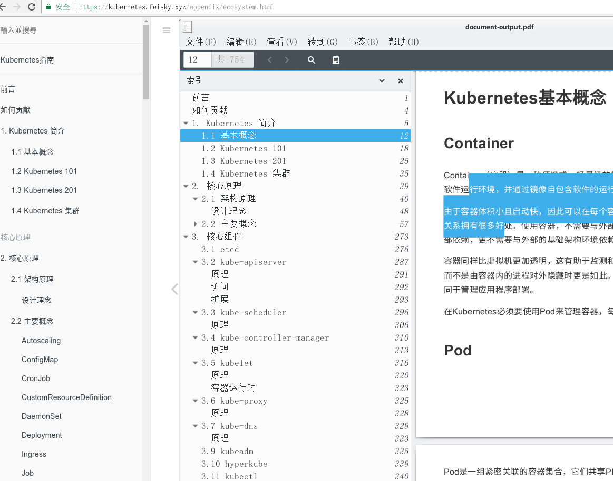

大部分gitbook都提供了PDF文档下载，其他则只能使用在线浏览的方式，gitbook的龟速网络实在难以满足需要，所以有了下面的工具：

1. 利用爬虫`scrapy`将特定gitbook的左列文档目录抓下来
1. 借助`selenium`使用chrome浏览器的另存pdf将文档download下来，在此之前，使用`jquery`对文档进行部分删减和调整
1. 借助`PyPDF2`将donwload下来的单个文档合并，并适配原先的目录结构



# 准备环境

``` bash
virtualenv -p python3 venv
. venv/bin/activate
```

## 安装python依赖项
``` bash
pip install -r requirements.txt
```

## 安装chrome
1. 安装最新的[chrome浏览器](https://www.google.cn/chrome/browser/desktop/index.html)
2. 下载最新的[chromedriver](http://chromedriver.storage.googleapis.com/index.html)（匹配浏览器）
3. 将chromedriver[*.exe*]置于`PATH`路径下

# 下载单页pdf
修改`gitbook/spiders/gitbook.py`
``` python
# 需要保存pdf的gitbook地址
gitbook_url = 'https://kubernetes.feisky.xyz'
# 临时存放单个页面pdf的目录
gitbook_tmppdf_dir = './a/'
# 最多同时开启多少个打印到pdf实例
max_printer = 10
```

运行命令
``` bash
scrapy crawl gitbook
```

# 合并pdf
修改`conbine.py`
``` python
# 临时存放单个页面pdf的目录
gitbook_tmppdf_dir = './a/'
# 生成的目标pdf文件
output_pdf = "gitbook.pdf"
```

运行命令
``` bash
python ./combine.py
```

# 使用selenium-server
以`selenium-server-standalone-3.8.1.jar`为例，运行下面命令启动服务器
``` bash
king@king:~/tmp$ java -jar selenium-server-standalone-3.8.1.jar
Selenium build info: version: '3.8.1', revision: '6e95a6684b'
Launching a standalone Selenium Server
...
Started ServerConnector@306279ee{HTTP/1.1,[http/1.1]}{0.0.0.0:4444}
Started @2829ms
Selenium Server is up and running
```

在代码`gitbook/spiders/gitbook.py`中，反转
``` python
service = chrome_service.Service("chromedriver")
service.start()
self.service = service
self.capabilities = options.to_capabilities()
# ---
# self.driver = webdriver.Remote(
#     command_executor='http://192.168.1.160:4444/wd/hub',
#     desired_capabilities=options.to_capabilities()
# )
```

使用`selenium-server`可以支持跨主机调用**selenium**

# 定制页面
引入**selenium**主要实现两个目标
1. 定制页面（使用jquery）
2. 完美的另存pdf（利用chrome浏览器`打印到PDF`功能）

``` python
driver.execute_script("""
    (function(){
        var scip = document.createElement("script");

        newatt=scip.setAttribute("src","https://cdn.bootcss.com/jquery/3.2.1/jquery.min.js");
        newatt=scip.setAttribute("type","text/javascript");
        newatt=scip.setAttribute("charset","utf-8");

        x=document.getElementsByTagName("head")[0];
        x.appendChild(scip);
        $(".pull-left")[0].click()
        $(".navigation-next,.navigation-prev,.book-header,.page-footer,.gitbook-donate,.treeview__container").each(function(){
            $(this).remove();
        });
        $("#disqus_thread").each(function(){
            $(this).remove();
        });
        $(".book-body").css("position","static");

    })()
""")
```

若`jquery.min.js`加载较慢，可视情况修改

在这里可以在打印到PDF前利用jquery对页面做任何能做的修改。
``` js
// 隐藏左边菜单
$(".pull-left")[0].click()
// 删除周边不需要的元素
$(".navigation-next,.navigation-prev,.book-header,.page-footer,.gitbook-donate,.treeview__container").each(function(){
    $(this).remove();
});
// 删除周边不需要的元素
$("#disqus_thread").each(function(){
    $(this).remove();
});
$(".book-body").css("position","static");
```

# Windows
下面python.exe路径自行调整

推荐在[git for windows](https://gitforwindows.org/)的shell中运行
``` bash
pip install virtualenv
virtualenv -p "C:\\Users\\test\\AppData\\Local\\Programs\\Python\\Python35\\python.exe" venv
. venv/Scripts/activate
pip install -r ./requirements.txt
```

三方库[PyPDF2](https://github.com/mstamy2/PyPDF2)和scrapy存在需要Windows下本地编译的问题，若无vs的toolchain，或者编译安装失败，可以考虑`合并PDF`这一步在Linux下完成。也可以使用`selenium-server`只将另存PDF功能在Windows上完成
``` bash
error: Microsoft Visual C++ 14.0 is required. Get it with "Microsoft Visual
C++ Build Tools": http://landinghub.visualstudio.com/visual-cpp-build-tools
```

关于`scrapy`在windows下的安装，可以参考<https://my.oschina.net/zzpio/blog/855627>

在CMD下，仅仅下面的命令不一样
``` bash
venv/Scripts/activate.bat
```

